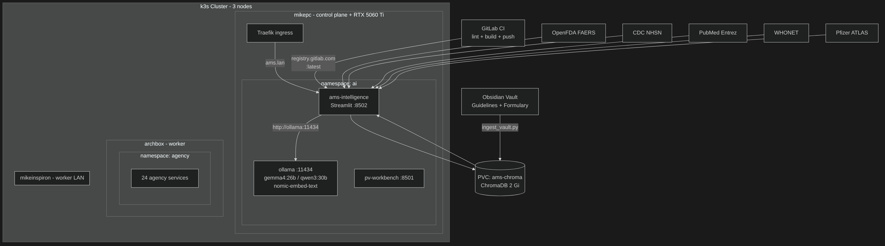

# AMS Intelligence

**Local-LLM antimicrobial stewardship platform · Program-agnostic · Clinician-built**

A production-grade clinical AI platform that pairs two decades of critical care and infectious disease expertise with signal detection algorithms and RAG-powered guideline retrieval. Built by the pharmacist who led an organization to IDSA Antimicrobial Stewardship Center of Excellence designation  -  every AI output is reviewed by the clinician before any patient care or reporting use.

---


**Design principle:** Confounding by indication is explicitly modeled  -  last-resort antibiotics treat critically ill patients. Statistical signals are always interpreted in clinical context, not in isolation.

---

## Kubernetes Deployment (Production)

Deployed on a three-node **k3s cluster** in the `ai` namespace.

| Node | Role | IP |
|---|---|---|
| **mikepc** | Control plane + GPU (RTX 5060 Ti) | Tailscale |
| **archbox** | Worker | Tailscale |
| **mikeinspiron** | Worker (LAN only) | LAN |



```bash
kubectl apply -f ~/homelab-infra/k8s/ams-intelligence.yaml
# Dashboard: http://ams.lan  (add 192.168.4.54 ams.lan to /etc/hosts)
```

### Secrets

```bash
# Registry pull secret (shared with other ai-namespace workloads)
kubectl create secret docker-registry gitlab-registry -n ai \
  --docker-server=registry.gitlab.com \
  --docker-username=<gitlab-user> \
  --docker-password=<pat-read-registry>

# Auth (streamlit-authenticator secrets.toml)
kubectl create secret generic ams-intelligence-secrets -n ai \
  --from-file=secrets.toml=/path/to/secrets.toml
```

### Vault ingestion

`scripts/` is baked into the image (`COPY scripts/ ./scripts/` in Containerfile):

```bash
# Guidelines only (fast, ~2 min)
kubectl exec -n ai deployment/ams-intelligence -- \
  python3 /app/scripts/ingest_vault.py --guidelines-only

# Full ingest including PubMed literature (slow, ~15 min)
kubectl exec -n ai deployment/ams-intelligence -- \
  python3 /app/scripts/ingest_vault.py
```

### CI/CD

Every push to `master` triggers GitLab CI (`.gitlab-ci.yml`):
1. `lint` - ruff check
2. `build` - builds and pushes `registry.gitlab.com/molszewski423/ams-intelligence:latest`

Rollout: `kubectl rollout restart deployment/ams-intelligence -n ai`

### Ollama (shared in-cluster)

`OLLAMA_BASE_URL=http://ollama:11434` - served by the Ollama pod on mikepc (RTX 5060 Ti).
Models: `gemma4:26b` (REASON\_MODEL), `qwen3:30b` (CODE\_MODEL), `nomic-embed-text` (EMBED\_MODEL).

---

## The Problem This Solves

Antimicrobial stewardship programs face a daily data problem: resistance surveillance feeds from NHSN and WHONET, adverse event signals from FAERS, utilization trends, literature updates, and institutional formulary decisions  -  often managed manually across spreadsheets and disparate portals. Commercial platforms are expensive, cloud-dependent, and rarely designed by stewardship clinicians.

This platform brings the full AMS analytical workflow local, private, and clinician-controlled:
- Aggregate five surveillance databases into a unified signal detection pipeline
- Apply the same disproportionality methods used in pharmacovigilance (PRR/ROR) to antibiotic utilization data
- RAG over institutional guidelines, formulary docs, and stewardship policies via an Obsidian-compatible vault
- Generate PDF trend reports and LinkedIn-ready stewardship highlights
- All inference runs locally  -  no patient data leaves the machine

---

## System Architecture

```
src/
├── dashboard/
│   ├── app.py                        # Entry point, auth gate
│   └── pages/
│       ├── 1_Resistance_Trends.py    # AMR trend visualization
│       ├── 2_Utilization_Signals.py  # Disproportionality analysis
│       └── 3_Files.py                # Vault document browser
├── data_sources/
│   ├── nhsn_client.py                # CDC NHSN API
│   ├── faers_client.py               # FDA FAERS API
│   ├── whonet_client.py              # WHONET data ingestion
│   ├── pubmed_client.py              # PubMed literature search
│   └── atlas_client.py               # Pfizer ATLAS surveillance
├── modules/
│   ├── resistance_analyzer.py        # Trend detection logic
│   └── utilization_detector.py       # PRR/ROR signal detection
└── shared/
    ├── disproportionality.py         # Signal detection algorithms
    ├── pdf_exporter.py               # Report generation (fpdf2)
    └── vault_ingestor.py             # Markdown → ChromaDB pipeline
gateway/
├── src/
│   ├── app.py                        # Authenticated portal entry point
│   └── auth.py                       # bcrypt + session management
└── assets/logos/                     # Regulatory agency logos
```

---

## Tech Stack

| Layer | Choice | Why |
|---|---|---|
| **LLM** | Ollama via LangChain `ChatOllama` | Local inference  -  no patient data in the cloud; GPU scheduling via Ollama |
| **Embeddings** | `nomic-embed-text` via Ollama | Local, no API key, strong retrieval on clinical text |
| **Vector Store** | ChromaDB (persistent, per-program collections) | Program isolation without separate servers |
| **Signal Detection** | NumPy + SciPy (PRR · ROR · Chi²) | Production-grade disproportionality matching pharmacovigilance standards |
| **Visualization** | Matplotlib + Seaborn | Resistance trend charts, utilization heat maps |
| **Dashboard** | Streamlit | Rapid iteration; runs locally, no frontend build step |
| **Surveillance APIs** | OpenFDA FAERS · CDC NHSN · PubMed Entrez | Standard APIs; FAERS uses quarterly partitioning to bypass 5000-result cap |
| **PDF Generation** | fpdf2 | Formatted resistance trend reports and stewardship summaries |
| **Auth** | streamlit-authenticator + bcrypt | Role-based access for clinical teams |
| **Container** | Podman / Docker (Containerfile) | Rootless Podman build; pushed to `registry.gitlab.com` |
| **Orchestration** | k3s (Kubernetes) | Two-node cluster; Traefik ingress; `ai` namespace |
| **CI/CD** | GitLab CI | lint (ruff) + container build + push on every push to `master` |
| **Hardware** | RTX 5060 Ti · 16GB VRAM · 32GB RAM | All LLM inference local via shared Ollama k3s pod |

---

## Spotlight: Utilization Signal Detection Pipeline

The utilization signal detection module applies pharmacovigilance-grade disproportionality analysis to antibiotic use data  -  the same statistical methods used in FDA FAERS signal detection, adapted for stewardship.

### What It Does

1. **Fetch**  -  Retrieves adverse event reports from OpenFDA using quarterly date-range partitioning. The FAERS API caps results at 5000 per search; partitioning into calendar quarters yields the complete dataset.

2. **Compute PRR**  -  Calculates Proportional Reporting Ratio against a configurable comparator antibiotic using the Evans criteria: **PRR ≥ 2.0 AND N ≥ 3 AND χ² ≥ 4.0**.

3. **Statistical rigor**  -  Three production-grade adjustments:
   - **Artifact exclusion**: Administrative FAERS PTs (`off label use`, `no adverse event`, `drug ineffective`) filtered before analysis
   - **Continuity correction**: b=0 reactions use b=0.5 instead of silent discard  -  preserves drug-specific signals
   - **Yates' χ² correction**: Applied when any expected cell count < 5, reducing false positives in sparse data

4. **Clinical interpretation**  -  LangChain + Ollama interprets all positive signals with confounding analysis, stewardship-specific context, and reviewer recommendations.

### PRR Formula

```
PRR = (a / (a+c)) / (b / (b+d))

           Drug    Comparator
Reaction     a          b
No Reaction  c          d

Signal if: PRR ≥ 2.0 AND a ≥ 3 AND χ² ≥ 4.0
```

### Clinically-Aware Design

Confounding by indication is the central challenge in AMS signal detection. Last-resort antibiotics (cefiderocol, colistin, ceftazidime-avibactam) are reserved for the sickest patients  -  high mortality signals in FAERS reflect the underlying infection, not the drug. The LLM interpretation layer is explicitly instructed to identify and weight this bias in every signal output.

---

## Three Dashboard Modules

| # | Module | What it does | Output |
|---|---|---|---|
| 1 | **Resistance Trends** | Tracks AMR patterns over time across organisms and drug classes from NHSN, WHONET, ATLAS | Trend charts, resistance rate tables |
| 2 | **Utilization Signals** | PRR/ROR disproportionality analysis on FAERS + NHSN utilization data | Signal table + LLM clinical interpretation |
| 3 | **Vault Browser** | Natural language querying of ingested clinical guidelines and formulary docs via RAG | Cited answers from institutional knowledge base |

---

## Program-Agnostic Design

Every module is parameterized by stewardship program, not hardcoded. Each program gets its own ChromaDB collection and vault folder:

```python
@dataclass
class ProgramConfig:
    program_name: str          # e.g. "community_hospital", "academic_medical_center"
    comparator: str            # FAERS background comparator antibiotic
    collection_name: str       # auto: ams_{program}  -  isolated ChromaDB collection
    vault_folder: str          # auto: Programs/{ProgramName}  -  per-program vault
    focus_organisms: list[str] # e.g. ["E. coli", "K. pneumoniae", "A. baumannii"]
    formulary_antibiotics: list[str]
```

Switching programs swaps all module contexts  -  resistance trend charts, signal detection comparators, vault retrieval  -  without code changes. The same platform serves a community hospital, academic medical center, or long-term care facility.

---

## Stewardship Knowledge Base

The RAG pipeline indexes structured markdown notes (Obsidian vault) covering AMS-specific content:

**Clinical Guidelines**
- IDSA Stewardship Guidelines  -  core stewardship program requirements
- ASHP Stewardship Resources  -  implementation tools, metrics
- CDC Core Elements  -  the seven core elements of hospital stewardship

**Antimicrobial Reference**
- Formulary antibiotic monographs
- Spectrum of activity tables
- PK/PD dosing principles for critical care

**Resistance**
- Resistance mechanism summaries by organism
- Local antibiogram interpretation notes
- Empiric therapy guidance by infection type

Notes use frontmatter `tags` and `source` fields. The ingester strips `[[wikilinks]]`, chunks by header hierarchy, and upserts idempotently using SHA-256 chunk IDs.

---

## Clinical Oversight Model

```
AI Output ──► is_draft=True ──► reviewer_flag=True ──► Stewardship Pharmacist Sign-off
                                                              │
                                                    clinical pharmacist · two decades critical care / ID / AMS
                                                    IDSA AMS Center of Excellence
```

The platform never makes final clinical or formulary determinations. `is_draft` cannot be set to `False` by any module function  -  it is a design invariant, not a configuration option. Signal outputs inform stewardship decision-making; they do not replace it.

---

## Quick Start

### Production (k3s)

```bash
kubectl apply -f ~/homelab-infra/k8s/ams-intelligence.yaml
# Access: http://ams.lan  (login: username=mike)
```

### Local Development

```bash
git clone https://gitlab.com/molszewski423/ams-intelligence.git
cd ams-intelligence

python3.11 -m venv .venv && source .venv/bin/activate
pip install -r requirements.txt

# Create .streamlit/secrets.toml with [credentials] and [cookie] sections
mkdir -p .streamlit

# Ingest guidelines
PYTHONPATH=src python scripts/ingest_vault.py --guidelines-only

# Launch
PYTHONPATH=src streamlit run src/dashboard/app.py --server.port 8502
# Dashboard at http://localhost:8502
```

### Vault Ingestion (k3s)

```bash
# Scripts are baked into the container image
kubectl exec -n ai deployment/ams-intelligence -- \
  python3 /app/scripts/ingest_vault.py --guidelines-only

# Verify vault contents
kubectl exec -n ai deployment/ams-intelligence -- python3 -c \
  "from shared.vault_ingestor import vault_stats; import json; print(json.dumps(vault_stats(), indent=2))"
```

### Report Generation

```bash
python scripts/generate_ams_slideshow.py   # PDF resistance trend report
python scripts/generate_linkedin_pdf.py    # LinkedIn stewardship summary
```

---

## Interfaces

### Streamlit Dashboard (Primary)

Runs locally at `localhost:8502`:

- **Program selector**  -  switch between stewardship programs; all modules update to reflect the active program
- **Resistance Trends**  -  AMR trend charts, organism resistance rates, drug class comparisons
- **Utilization Signals**  -  PRR signal table, Chi² values, LLM clinical interpretation with confounding analysis
- **Vault Browser**  -  natural language queries over ingested guidelines and formulary docs
- **PDF export**  -  resistance reports and stewardship summaries on demand

### Gateway Portal (Clinical Team Access)

The `gateway/` subdirectory contains an authenticated entry portal for clinical teams  -  ID physicians, infection control nurses, pharmacy staff. Role-based access controls which modules each user can reach.

```bash
cd gateway
streamlit run src/app.py --server.port 8500
```

---

## Technical Showcase

### Local-First Clinical AI

No patient data leaves the machine. All LLM inference runs on an RTX 5060 Ti 16GB, served by Ollama:

| Model | Role |
|---|---|
| Local LLM via Ollama | Signal interpretation, confounding analysis, guideline Q&A |
| `nomic-embed-text` | Vault embeddings (retrieval only) |

### Signal Detection

Statistical rigor matching pharmacovigilance standards:
- **PRR/ROR** using the 2×2 contingency table
- **Evans criteria**: PRR ≥ 2.0 AND N ≥ 3 AND χ² ≥ 4.0  -  all three required simultaneously
- **Continuity correction**: b=0 reactions use b=0.5  -  preserves novel drug-specific signals
- **Yates' χ² correction**: applied when any expected cell < 5
- **Artifact exclusion**: administrative FAERS PTs filtered before analysis
- **Quarterly pagination bypass**: `_fetch_quarter()` per calendar quarter overcomes 5000-result OpenFDA API cap

### Vector Database

ChromaDB with `nomic-embed-text` embeddings:
- **Header-aware chunking**: splits on H1/H2/H3 boundaries, not arbitrary character count
- **Idempotent ingestion**: SHA-256 chunk IDs; re-running is safe, changed notes update in place
- **Per-program isolation**: separate ChromaDB collections per stewardship program

### Infrastructure

| Component | Detail |
|---|---|
| **Cluster** | k3s v1.35; mikepc (control plane) + archbox + mikeinspiron (workers) |
| **Namespace** | `ai` - all AI workloads |
| **Ingress** | Traefik (k3s built-in); `ams.lan` → ams-intelligence:8502 |
| **Registry** | `registry.gitlab.com/molszewski423/ams-intelligence:latest` |
| **GPU** | RTX 5060 Ti 16 GB on mikepc; Ollama pod with RuntimeClass `nvidia` |
| **Storage** | k3s local-path PVCs: `ams-chroma` (2 Gi), `ams-output` (5 Gi), `ams-data` (5 Gi) |
| **OS** | Debian 13 (Trixie), Linux 6.12 |
| **Firewall** | nftables default-deny inbound on all nodes — `homelab-firewall.service` |
| **IDS/IPS** | CrowdSec + firewall bouncer, 28k+ community-blocked IPs |
| **DNS** | AdGuard Home — DoH/DoT upstreams, no plaintext DNS |
| **Ingress** | Cloudflare Tunnel — no open inbound ports on any machine |
| **Python** | 3.11 in container |

---

## How It's Built  -  Multi-AI Development Workflow

```
┌─────────────────────────────────────────────────────────────┐
│                   Human Supervision                         │
│        clinical pharmacist · two decades clinical care       │
│  Critical care · Infectious disease · AMS · IDSA CoE        │
└────────────┬──────────────┬──────────────────┬─────────────┘
             │              │                  │
    ┌────────▼─────┐ ┌──────▼──────┐  ┌───────▼────────┐
    │  Claude Code  │ │   Hermes    │  │  Local LLM     │
    │  (Architect)  │ │(Implementor)│  │  (Reasoner)    │
    │               │ │             │  │                │
    │ Architecture  │ │  Module     │  │ Clinical       │
    │ Task specs    │ │  implement- │  │ interpretation │
    │ Complex fixes │ │  ation      │  │ Signal analysis│
    │ Code review   │ │  Tool calls │  │ Guideline Q&A  │
    └───────────────┘ └─────────────┘  └────────────────┘
             │              │                  │
    ┌────────▼──────────────▼──────────────────▼─────────────┐
    │                   Shared Codebase                       │
    │           ~/ams-intelligence/  (this repo)              │
    └─────────────────────────────────────────────────────────┘
```

**Division of AI labor:**
- **Claude Code** (Anthropic): Architecture decisions, signal detection algorithm design, task spec authoring, code review. High-level thinking, broad context.
- **Hermes + Local LLM**: Module implementation from Claude's task specs. Autonomous implementation agent using the skill system.
- **Local LLM via Ollama**: Clinical reasoning at inference time  -  signal interpretation, confounding analysis, guideline Q&A. Not used in development, used in production.

---

## About

Built by a PharmD, BCPS, BCCCP with two decades of critical care and infectious disease experience who led an organization to IDSA Antimicrobial Stewardship Center of Excellence designation. The statistical methods aren't bolted on  -  they're the same disproportionality algorithms used in pharmacovigilance, applied to stewardship data by someone who understands both sides.

**Stack philosophy:** Local-first. No cloud dependencies for core function. Data stays on-machine. The LLM reasoning layer runs on consumer hardware (RTX 5060 Ti 16GB) and is explicitly designed around the clinical realities of stewardship  -  confounding by indication, last-resort antibiotic populations, and the difference between a statistical signal and a clinical finding.

---

*All AI outputs are drafts. Clinical determinations require qualified stewardship pharmacist review.*
